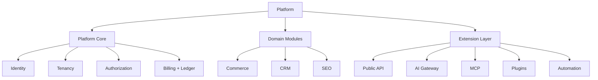
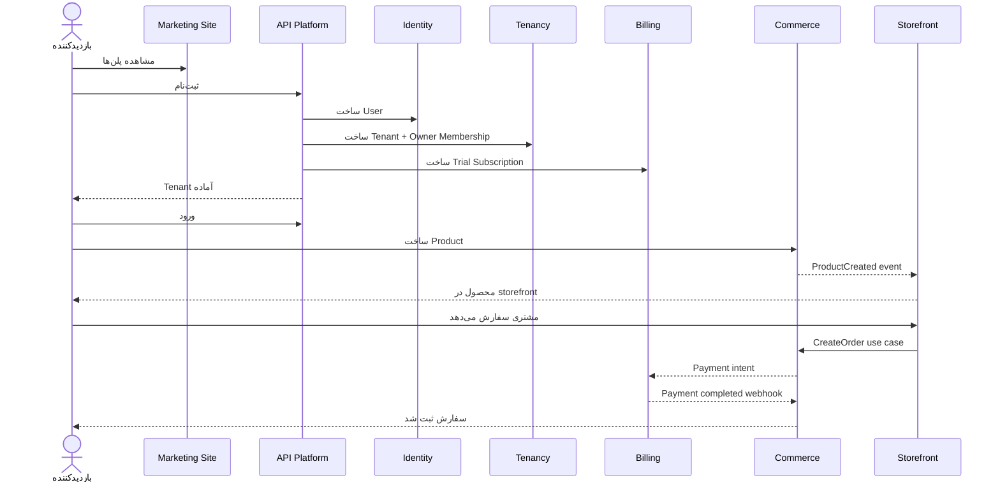
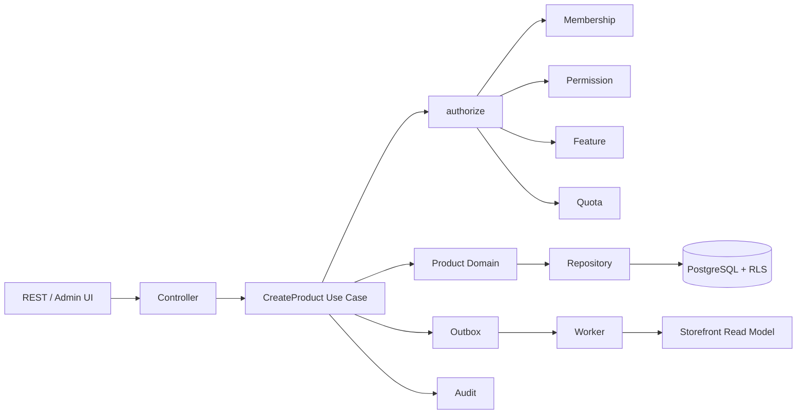
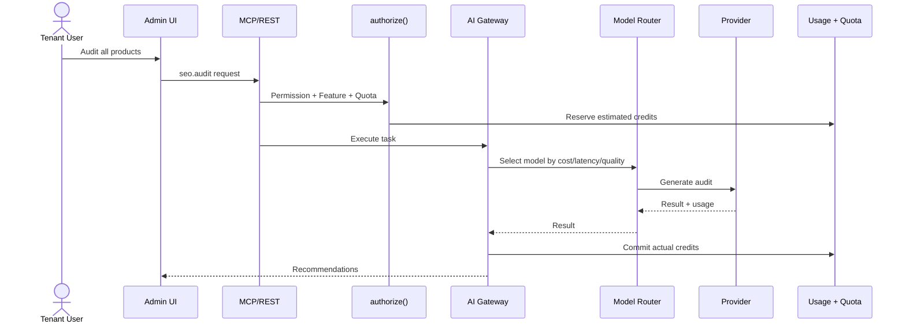

# سناریوی کامل محصول از صفر تا عملیات

## ۱. این پلتفرم دقیقاً چیست؟

این محصول یک **SaaS Platform چندمستاجری** است که به کسب‌وکارها اجازه می‌دهد یک فضای کاری/فروشگاه ایجاد کنند، اعضای تیم را دعوت کنند، دامنه متصل کنند، محصولات و سفارش‌ها را مدیریت کنند، و بعداً ماژول‌های CRM، SEO، اتوماسیون و AI را بدون تغییر هسته فعال کنند.

Commerce اولین محصول قابل‌فروش است، نه مالک معماری.



## ۲. مسیر اصلی مشتری



## ۳. سناریوی ثبت‌نام

### ورودی

- email
- password
- displayName
- tenantName
- tenantSlug
- locale
- timezone

### عملیات اتمیک

1. نرمال‌سازی ایمیل و slug
2. بررسی یکتایی ایمیل
3. هش رمز با Argon2id
4. ساخت User با وضعیت `pending_verification`
5. ساخت Tenant با وضعیت `active`
6. ساخت Membership با نقش `owner`
7. ساخت توکن تأیید، ذخیره فقط hash
8. ثبت Audit
9. ثبت Outbox برای `user_registered` و `tenant_created`
10. commit
11. ارسال ایمیل توسط Worker

اگر هر مرحله قبل از commit شکست بخورد، هیچ User ناقص یا Tenant یتیمی باقی نمی‌ماند.

## ۴. سناریوی ورود

```text
Request
 -> rate limit
 -> normalize email
 -> load credential
 -> verify Argon2id
 -> check email verification
 -> check MFA challenge
 -> create session
 -> issue access token
 -> set rotated refresh cookie
 -> audit success
```

### نتیجه

- Access token: کوتاه‌عمر، حدود ۱۵ دقیقه
- Refresh token: opaque، داخل HttpOnly cookie، حدود ۳۰ روز
- Session: قابل revoke، قابل مشاهده برای کاربر

## ۵. سناریوی سوییچ Tenant

```text
User
 -> انتخاب Tenant B
 -> پیدا کردن Membership فعال برای User + Tenant B
 -> بررسی active بودن Tenant
 -> ساخت Tenant Context
 -> محاسبه Authorization Context
 -> محاسبه Feature Context
 -> ادامه درخواست‌ها با Tenant B
```

توکن اصلی tenant-agnostic است؛ Tenant از context درخواست می‌آید و هر بار Membership اعتبارسنجی می‌شود.

## ۶. سناریوی ساخت محصول



## ۷. سناریوی سفارش

1. خریدار از دامنه Tenant وارد می‌شود.
2. Tenant از host/domain mapping تعیین می‌شود، نه از header دلخواه.
3. Customer یا Guest Customer شناسایی می‌شود.
4. سبد فقط draft است و موجودی را رزرو نمی‌کند.
5. Checkout قیمت و موجودی را دوباره از منبع حقیقت می‌خواند.
6. موجودی با `UPDATE ... WHERE available >= quantity` رزرو می‌شود.
7. Order با snapshot قیمت و عنوان ساخته می‌شود.
8. Payment intent ساخته می‌شود.
9. Webhook پرداخت خام و idempotent ذخیره می‌شود.
10. پرداخت موفق، سفارش را به `paid` می‌برد.
11. رزرو موجودی قطعی می‌شود.
12. ایمیل و Read Model از طریق Outbox به‌روز می‌شوند.

## ۸. سناریوی Downgrade

```text
5000 محصول موجود
 -> تغییر به پلن 500 محصول
 -> داده‌ها حفظ می‌شوند
 -> ایجاد محصول جدید بعد از 500 رد می‌شود
 -> مشاهده و export داده مجاز می‌ماند
 -> UI پیام ارتقا نشان می‌دهد
 -> با Upgrade دوباره ایجاد فعال می‌شود
```

## ۹. سناریوی AI SEO



## ۱۰. سناریوی افزودن CRM

CRM فقط این قراردادها را اضافه می‌کند:

- Domain entities: Contact, Lead, Deal
- Application use cases
- Permission registry
- Feature keys
- REST routes
- Events
- Optional MCP tools
- Tenant-bound tables with RLS

هیچ تغییری در User، Session، Tenant، Authorization یا Billing Core لازم نیست.
